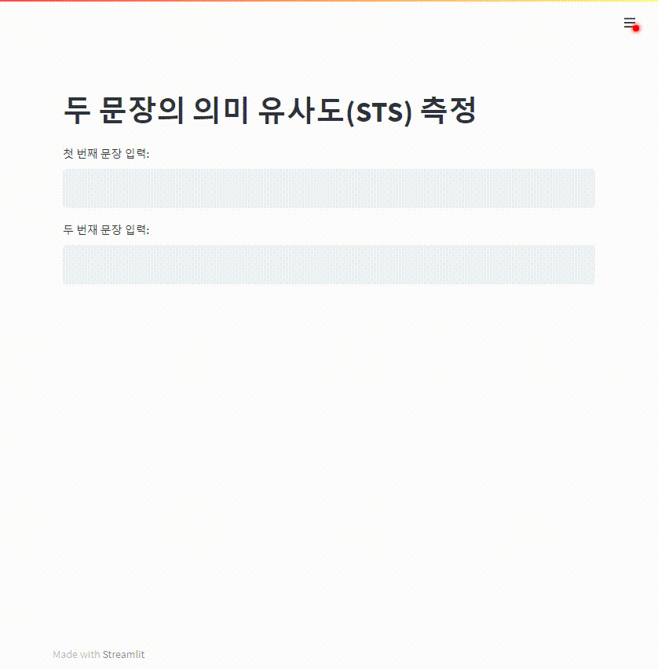

# 두 문장의 의미 유사도(STS) 측정 모델

[KLUE STS dev](https://github.com/wanted-AI-06/Assignment-03)의 Best model을 이용한 프로토타이핑

## 파일 구조
```
demo
├─requirements.txt
├─main.py
├─model.py
├─dataset.py
└─pytorch_model.bin
```
- 실행에 필수적인 파일만 나열
- best model 다운로드 : [pytorch_model.bin](https://drive.google.com/file/d/1Y9GFVzcmTH0Zas_ekt0PNz4xToqpvBnj/view?usp=sharing)
- best model 다운로드 후 demo 폴더에 위치해야 실행 가능

## 실행 방법
### 가상환경 설정
```
conda create -n sts python=3.8
conda activate sts
pip install -r requirements.txt
```
- sts 대신 다른 이름으로 대체 가능


### FastAPI, Streamlit 실행

윈도우 
```
# FastAPI 백그라운드 실행
start /b python main.py

# Streamlit 포그라운드 실행
streamlit run front.py
```

`http://localhost:8501/` 에서 streamlit 데모 실행 가능


## 시연 영상



## Reference
`dataset.py` and `model.py` in this repo is based on [LostCow/KLUE](https://github.com/LostCow/KLUE)
